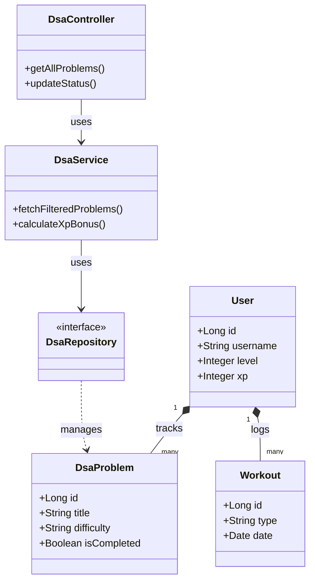
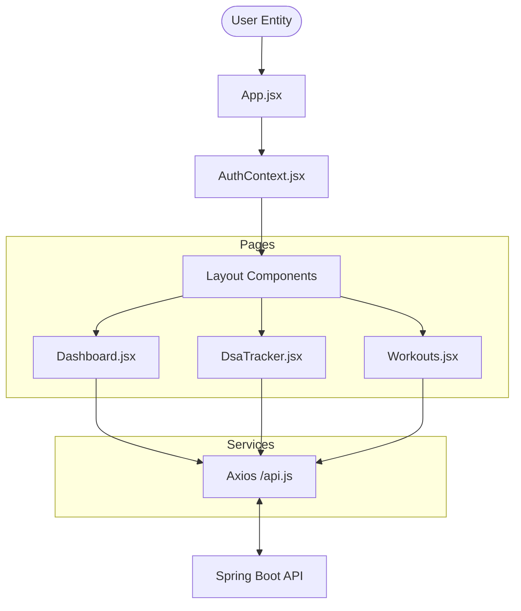
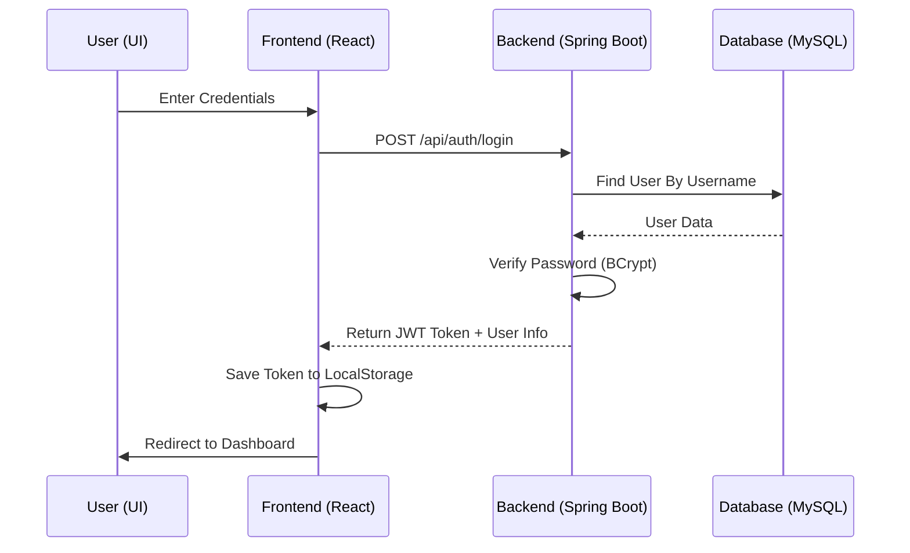

# Personal Tracker: Project Overview

The **Personal Tracker** is a full-stack, gamified application designed to help users track their progress in Data Structures and Algorithms (DSA), physical fitness (Workouts), and mental well-being (Journaling). The application uses a "Solo Leveling" inspired aesthetic with XP bars, levels, and daily quests to encourage consistency.

---

## 📂 Project Structure

### 🏗 Backend (`tracker-backend`)
Built with **Spring Boot 3 (Java 25)** and **MySQL**.

- **`src/main/java/com/tracker/personal_tracker/`**
  - **`controller/`**: REST API endpoints for communication with the frontend.
    - `AuthController.java`: Handles user registration and login.
    - `DsaController.java`: Manages DSA problems and progress.
    - `WorkoutController.java`: Manages workout logs and exercises.
    - `JournalController.java`: Manages daily reflection entries.
    - `DailyQuestController.java`: Manages gamified daily tasks.
  - **`service/`**: Core business logic.
    - `DsaService.java`: Logic for filtering problems and updating status.
    - `AuthService.java`: Logic for security and token generation.
    - `SystemGamificationService.java`: Logic for XP calculation and leveling up.
    - `DataSeeder.java`: Seeds the initial 150 DSA problems into the database.
  - **`entity/`**: Database models (JPA Entities).
    - `User.java`: Stores credentials, XP, and level.
    - `DsaProblem.java`: Stores problem details (Topic, Pattern, Difficulty).
    - `Workout.java`: Stores workout sessions.
    - `JournalEntry.java`: Stores daily reflections.
  - **`repository/`**: Data Access Layer (Spring Data JPA).
    - Interfaces for CRUD operations on all entities.
  - **`security/`**: JWT-based authentication configuration.
    - `SecurityConfig.java`: Configures CORS, JWT filters, and public/private routes.
    - `JwtUtils.java`: Utility for generating and validating tokens.
  - **`dto/`**: Data Transfer Objects for API requests/responses.
- **`src/main/resources/`**
  - `application.properties`: Configuration for database connection and server port.

### 🎨 Frontend (`tracker-frontend`)
Built with **React**, **Vite**, and **Tailwind CSS**.

- **`src/`**
  - **`pages/`**: Main views of the application.
    - `Login.jsx` / `Register.jsx`: Authentication screens.
    - `Dashboard.jsx`: Central hub showing overview and XP progress.
    - `DsaTracker.jsx`: Interactive list of DSA problems with filters.
    - `Workouts.jsx`: Interface for logging and viewing workouts.
    - `Journal.jsx`: Daily reflection form.
  - **`components/`**: Reusable UI elements.
    - `level-up/XpBar.jsx`: Progress bar showing user level and XP.
    - `workout/AddWorkoutModal.jsx`: Form for adding new workouts.
    - `Navigation/`: Navbar and sidebar components.
  - **`api/`**: Axios configuration and service modules.
    - `api.js`: Base Axios instance with interceptors for JWT.
    - `workoutService.js`, `dsaService.js`, etc.: API call wrappers.
  - **`context/`**: State management.
    - `AuthContext.jsx`: Manages user session and login state globally.
  - **`assets/` & `styles/`**: Global styles (Tailwind) and images.

---

## 🔗 How They Are Linked

1.  **Communication**: The Frontend communicates with the Backend via **RESTful APIs** using the **Axios** library.
2.  **Security**:
    - When a user logs in, the Backend (`AuthController`) generates a **JWT token**.
    - The Frontend stores this token (usually in `localStorage` or `State`).
    - For every subsequent request, the Frontend includes the token in the `Authorization` header.
    - The Backend's `JwtAuthFilter` intercepts the request, validates the token, and allows the action if authorized.
3.  **Persistence**: The Backend uses **Spring Data JPA** to map Java objects to the **MySQL** database.
4.  **Data Flow**:
    - **Frontend** -> (JSON via HTTP) -> **Backend Controller** -> **Service** -> **Repository** -> **MySQL Database**.

---

## 📊 UML Diagrams

### Backend Class Structure (High Level)

### Frontend Architectural Flow

### Authentication Flow (Sequence)

